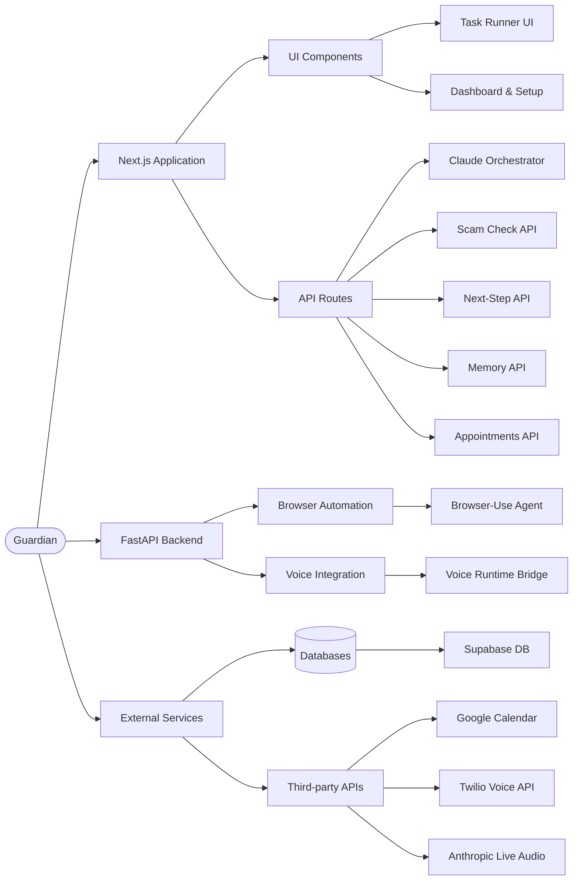
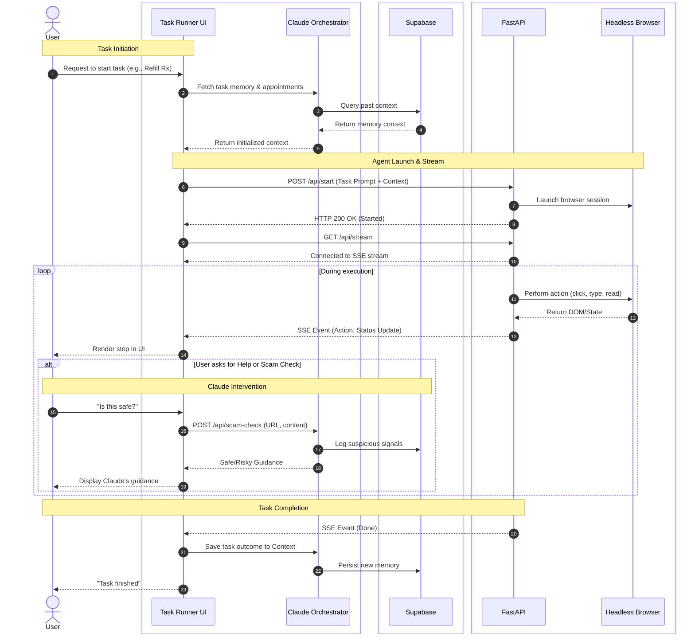
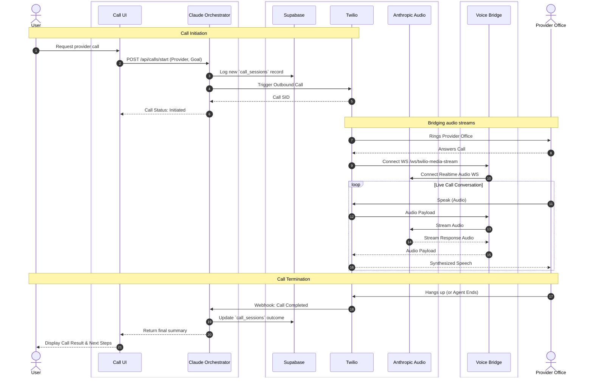

# 🛡️ Guardian (formerly SafeStep)

> **An intelligent, multimodal browser copilot for senior support and high-stakes online tasks.**


**Guardian** is a specialized browser agent test harness designed to bridge the digital divide for older adults navigating complex online workflows—especially healthcare portals, pharmacy refills, and appointment scheduling. 

Providing proactive scam protection, stateful memory context, and live provider calling capabilities, Guardian assists users without stripping away their autonomy.

---

## ✨ Key Features

*   **🕵️ Guided Browsing Agent**: A headless Playwright browser agent driven by Claude orchestrates difficult multi-step tasks natively in the browser, streaming step-by-step UI events back to the user via SSE.
*   **🛡️ Scam Risk Intervention**: Built-in API endpoints evaluate current URLs and DOM content against known deceptive patterns, giving users a trusted "Is this safe?" checkpoint.
*   **🧠 Contextual Memory**: Uses a Supabase backend to keep track of past tasks and specific nuances (e.g., *“I usually pick up prescriptions at the CVS on Elm St”*) so the copilot can assist gracefully. 
*   **📅 Appointment-Aware Guidance**: Google Calendar integration aligns browsing tasks with upcoming medical appointments to prep users effectively with the information that matters.
*   **📞 Twilio Voice Bridge**: An integrated Anthropic Voice to Twilio bridge that calls provider offices on the user's behalf for administrative tasks (e.g., checking hours, confirming necessary documents to bring).

## 🏗️ Architecture

Guardian is sliced into a modern, highly-decoupled stack:

1.  **Frontend & Orchestrator**: A **Next.js App Router** application that acts as the UI and the central Claude AI Orchestrator. 
2.  **Agent Backend**: A **Python FastAPI** server that drives the `browser-use` automation library and manages the real-time WebSocket bridge between Twilio Media Streams and Anthropic Live audio models.
3.  **Data Layer**: **Supabase** handles relational context mapping for `call_sessions`, task history, and persistent scam evaluation logs.

### Component Hierarchy



<details>
<summary><strong>🔍 Click to expand: Browser Task & Provider Calling Sequence Flowcharts</strong></summary>

### Browser Agent Task Flow



### Twilio Provider Calling Flow


</details>

*(Check out our [PRD](./PRD.md) for deep dives into system logic).*

---

## 🚀 Getting Started

### 1. Requirements

*   Node.js (v20+)
*   Python (3.11+)
*   Supabase CLI *(optional, but recommended for local database interactions)*

### 2. Environment Configuration

You need to establish environment variables for both halves of the stack limit.

**Frontend (`.env.local`)**:
```bash
NEXT_PUBLIC_SUPABASE_URL=your_supabase_url
SUPABASE_SERVICE_ROLE_KEY=your_service_role_key
GOOGLE_CALENDAR_API_KEY=your_calendar_key
```

**Backend (`backend/.env`)**:
```bash
# Core AI orchestration
ANTHROPIC_API_KEY=your_claude_key

# Twilio integration layer
TWILIO_ACCOUNT_SID=...
TWILIO_AUTH_TOKEN=...
TWILIO_VOICE_EVENTS_SECRET=...
TWILIO_MEDIA_STREAM_URL=wss://your-backend.ngrok.app/ws/twilio-media-stream
BACKEND_PUBLIC_BASE_URL=https://your-backend.ngrok.app
```

### 3. Database Initialization (Supabase)

Guardian requires Supabase for task context, memory, and call persistence schemas. Apply the SQL files locally or to your cloud instance in the following order:

```bash
1. supabase/migrations/20260419000100_safestep_init.sql
2. supabase/migrations/20260419000300_expand_call_sessions.sql
3. supabase/seed.sql
```

### 4. Running the Application locally

For full functionality, both servers must be running simultaneously in separate terminal sessions.

**Launch the FastAPI Backend:**
```bash
cd backend
python -m venv venv
source venv/bin/activate
pip install -r requirements.txt
uvicorn main:app --reload --port 8000
```

**Launch the Next.js Frontend Orchestrator:**
```bash
# In the project root
npm install
npm run dev
```

Navigate to **[http://localhost:3000](http://localhost:3000)** to launch the Copilot UI!

---

## 🧭 Future Roadmap

- **Phase 1**: Stabilize backend agent event streaming mapping strictly to the Next.js UI components.
- **Phase 2**: Harden the Twilio Live Audio infrastructure for low-latency call routing and fallback handling.
- **Phase 3**: Transition UI focus to a Chrome Extension integration (bringing the copilot out of the validation sandbox and natively into the actual browser).

## 📜 Notice & Compliance

*Please note: This repository is a technical validation prototype. Do not deploy the Twilio Voice auto-dialer or automated scraper logic in live healthcare environments without complying with strict HIPAA/PII protocols. Provider calling functionality operates heavily on user consent pipelines and must be heavily monitored.*
